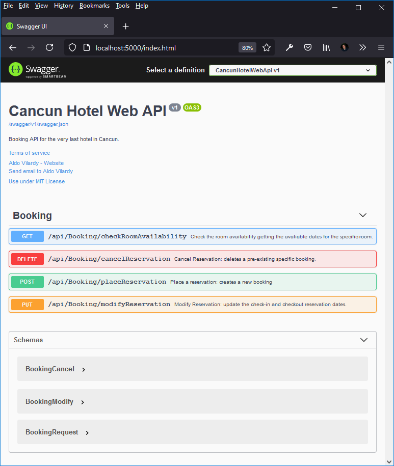
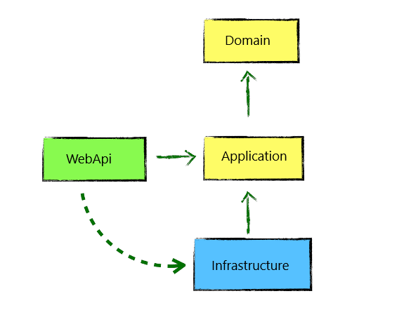
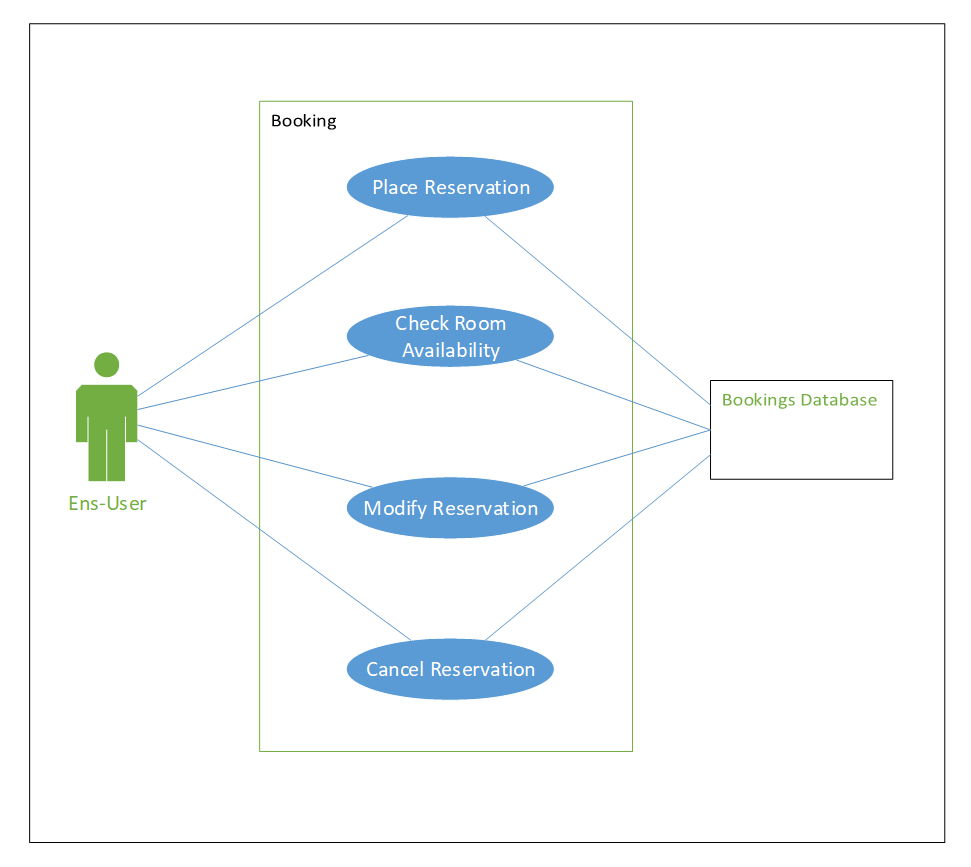
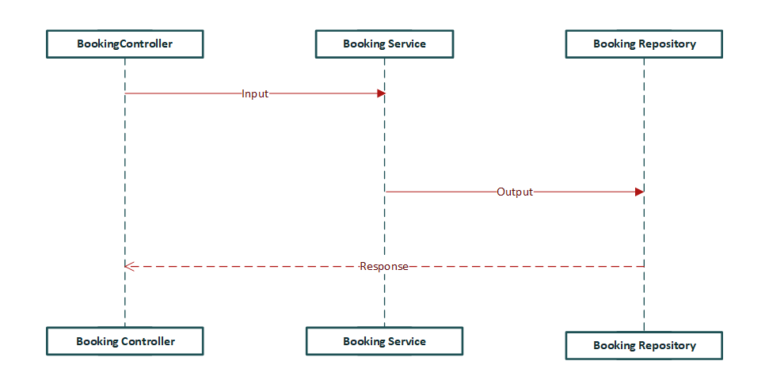
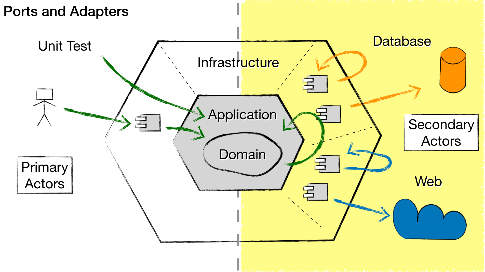
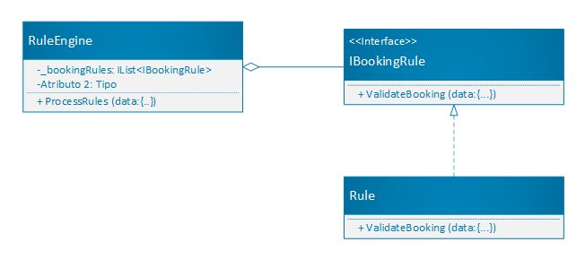

# Cancun Hotel Clean Architecture Web API

Alten Canada Challenge Post-Covid scenario demo implementation of the Clean Architecture Principles with .NET 5. Use cases as central organizing structure, decoupled from frameworks and technology details. Built by small components that are developed in isolation.

### Technologies

* [ASP.NET Core 5](https://docs.microsoft.com/en-us/dotnet/core/dotnet-five)
* [Entity Framework Core 5](https://docs.microsoft.com/en-us/ef/core/)
* [SQL Server](https://www.microsoft.com/en-us/sql-server/sql-server-2019)
* [Swagger](https://swagger.io/solutions/api-documentation/)
* [Docker](https://www.docker.com/)

## The Challenge
Post-Covid scenario:
People are now free to travel everywhere but because of the pandemic, a lot of hotels went bankrupt. Some former famous travel places are left with only one hotel.
You’ve been given the responsibility to develop a booking API for the very last hotel in Cancun.

### Requirements

The requirements are:
- API will be maintained by the hotel’s IT department.
- As it’s the very last hotel, the quality of service must be 99.99 to 100% => no downtime
- For the purpose of the test, we assume the hotel has only one room available
- To give a chance to everyone to book the room, the stay can’t be longer than 3 days and can’t be reserved more than 30 days in advance.
- All reservations start at least the next day of booking,
- To simplify the use case, a “DAY’ in the hotel room starts from 00:00 to 23:59:59.
- Every end-user can check the room availability, place a reservation, cancel it or modify it.
- To simplify the API is insecure.

## Getting Started

To accomplish the requirements:

* The API could be manage by IT department using docker containers orchestation.
* The docker containers orchestation can be configured on a web cloud service like Azure, AWS, GCP, IBM Cloud, etc. And configure it with a horizontal scaling service plan to guarantee the service 99.99% to 100% and with multizone desaster recovery approach to avoiding the downtime.
* The adding of the only room is made in seeding definition and applied during the database migration.
* Add validation rules using Rules Engine Pattern to define some business rules like:
    * The stay can’t be longer than 3 days
    * The stay can’t be reserved more than 30 days in advance
    * Reservations start at least the next day of booking
* The end-user actions are defined as REST verbs call to the web API like this:
    *  `GET` **/api/Booking/checkRoomAvailability - Check the room availability getting the avaliable dates for the specific room.
        * Parameter: 

        | Name   | Description     | Type            |
        |--------|-----------------|-----------------|
        | roomId | Room Identifier | integer($int32) |
        
    *  `DELETE` /api/Booking/cancelReservation - Cancel Reservation: deletes a pre-existing specific booking.
        * Request body:
        ```json
        {
            "clientEmail": "user@example.com",
            "bookingId": 0
        }
        ```
    * `POST` /api/Booking/placeReservation - Place a reservation: creates a new booking
        * Request body:
        ```json
        {
            "clientEmail": "user@example.com",
            "from": "2021-05-14",
            "to": "2021-05-14"
        }
        ```
    * `PUT` /api/Booking/modifyReservation - /api/Booking/modifyReservation
        * Request body:
        ```json
        {
            "bookingId": 0,
            "clientEmail": "user@example.com",
            "from": "2021-05-14",
            "to": "2021-05-14"
        }
        ```

* The API doen't use authentication or roles methods to make it secure but have a rule in modify that permits modify the booking dates only if the email is the same registered orillinaly.

## Environment Configurations

Install [.NET 5 SDK](https://dotnet.microsoft.com/download/dotnet/5.0)

### Certificates
Trust the HTTPS development certificate by running the following command:

For Windows (powershell):
```powershell
PS :\> dotnet dev-certs https --clean
PS :\> dotnet dev-certs https -ep $env:USERPROFILE\.aspnet\https\aspnetapp.pfx -p MyCertificatePassword
PS :\> dotnet dev-certs https --trust
```

Select Yes if you agree to trust the development certificate.

For MacOS & Linux:
```bash
$ dotnet dev-certs https --clean
$ dotnet dev-certs https -ep ${HOME}/.aspnet/https/aspnetapp.pfx -p 
$ dotnet dev-certs https --trust
```

The preceding command displays the following dialog:


For more detailed info got to [Enforce HTTPS in ASP.NET Core](https://docs.microsoft.com/en-us/aspnet/core/security/enforcing-ssl?view=aspnetcore-5.0#trust-the-aspnet-core-https-development-certificate-on-windows-and-macos)

### Docker

Install docker [Docker Desktop](https://www.docker.com/products/docker-desktop) for [Windows](https://hub.docker.com/search?offering=community&q=&type=edition&operating_system=windows)/[Mac](https://hub.docker.com/search?offering=community&q=&type=edition&operating_system=mac) or [Docker Engine for Linux](https://hub.docker.com/search?offering=community&q=&type=edition&operating_system=linux)

In order to startup the whole solution build and run the docker containers, from the root of the solution "CancunHotelWebApi" where you find the docker-compose.yml file execute the following command:

```powershell
docker compose -f 'docker-compose.yml' up --build
```

This will run two containers: an SQL Server one and ASP.NET 5 Web API in that you can access in your web browser at `http://localhost:5000` Swagger UI



### Local Environment

Change directories (cd) to the folder that will contain the project folder .

```powershell
cd \CancunHotel-Clean-WebApi\CancunHotelWebApi\src\CancunHotel.WebApi
dotnet build
```

#### Database Configuration

If you would like to to set up a specific SQL Server infrastructure for debug, you will need to update **CancunHotelWebApi/appsettings.json** 
```json
{
  "ConnectionStrings": {
    "DefaultConnection": "Server=localhost\\MSSQLSERVER19;Initial Catalog=BookingsDb;Persist Security Info=False;User ID=sa;Password=My_SecretPassword123;MultipleActiveResultSets=False;Encrypt=True;TrustServerCertificate=True;Connection Timeout=30;"
  },
  "Logging": {
    "LogLevel": {
      "Default": "Information",
      "Microsoft": "Warning",
      "Microsoft.Hosting.Lifetime": "Information"
    }
  },
  "AllowedHosts": "*"
}
```

Verifying that the **DefaultConnection** connection string within **appsettings.json** points to a valid SQL Server instance. 

When you run the application the database will be automatically created (if necessary) and the latest migrations will be applied.

### Database Migrations

To use `dotnet-ef` for your migrations please add the following flags to your command (values assume you are executing from repository root)

* `--project CancunHotel-Clean-WebApi\CancunHotelWebApi\src\CancunHotel.Infrastructure` (optional if in this folder)
* `--startup-project CancunHotel-Clean-WebApi\CancunHotelWebApi\src\CancunHotel.WebApi`
* `--output-dir Migrations`

For example, to add a new migration from the root folder.

Run the EF Tool to add a migration to the `Infrastructure` project.
```console
dotnet ef migrations add "BookingsDb" --project CancunHotel-Clean-WebApi\CancunHotelWebApi\src\CancunHotel.Infrastructure --startup-project CancunHotel-Clean-WebApi\CancunHotelWebApi\src\CancunHotel.Infrastructure --output-dir Migrations
```

Generate tables and seed the database via Entity Framework Tool:

```console
dotnet ef database update --project CancunHotel-Clean-WebApi\CancunHotelWebApi\src\CancunHotel.Infrastructure --startup-project CancunHotel-Clean-WebApi\CancunHotelWebApi\src\CancunHotel.WebApi
```

## Overview

### Clean Architecture



#### Domain

This will contain all the `High Level Modules` like Entities, Enums, Exceptions, Interfaces and Value Objects types and logic specific to the domain layer.

#### Application

This layer contains all application service logic. It is dependent on the domain layer, but has no dependencies on any other Infrastructure layer or abstractions of external services (eg. Repositories). This layer defines interfaces that are implemented by outside layers. For example, if the application need to access a notification service, a new interface would be added to application and an implementation would be created within infrastructure.

#### Infrastructure

The infrastructure layer is responsible to implement the `Adapters` to the `Secondary Actors` so contains classes for accessing external resources such as file systems, web services, smtp, and so on. For instance an SQL Server Database is a secondary actor which is affected by the application use cases, all the implementation and dependencies required to consume the SQL Server is created on infrastructure. These classes should be based on interfaces defined within the application layer.

#### WebApi

This layer is a web api application based on ASP.NET 5.0.x. It depends on both the Application and Infrastructure layers, however, the dependency on Infrastructure is only to support dependency injection. Therefore only *Startup.cs* should reference Infrastructure. Made of Controller which receive HTTP Requests calls the services, recive ViewModels that are rendered as HTTP Responses. On this approach it is the application entry-point.

### Logs

Logging into default log and viewing logs in console.

### Use Cases | Services
Use Cases are algorithms that interpret the input to generate the output data, their implementation should be as close as possible to the business vocabulary.

When talking about a use case, it does not matter if it a Mobile or a Desktop application, use cases are delivery independent. The most important about use cases is how they interact with the actors.

* Primary actors initiate a use case. They can be the End User, another system, or a clock.
* Secondary actors are affected by use cases.

Application architecture is about usage, a good architecture screams the business use cases to the developer, and framework concerns are minor implementation details. On **Cancun Hotel Web API** sample the End-User can `Place Reservation`, `Check Room Availability`, `Modify Reservation`, and `Cancel Reservation`.

A set of use cases is used to describe software. Following the End-User primary actor on the left side, in the middle the Booking system and the secondary actors on the right side:



Following the list of Use Cases:

| Use Case | Description |
|-|-|
| Place Reservation | Creates a new booking |
| Check Room Avaliability | Check the room avaliability getting the avaliable dates for the spacific room. |
| Modify Reservation | Update the check-in and check-out reservation dates. |
| Cancel Reservation | Deletes a pre-existing specific booking. |

### Flow of Control

The flow of control begins at the controller, moves through the use case, and then winds up executing the presenter.

### Bookings Flow of Control

1. An HTTP request is received by the `BookingController` then the service action is invoked.
2. The `REST` action creates a `BookingInput` message then the a use case is called.
3. The `BookingService` use case creates the proper entities. Repositories are called, the `BookingOutput` message is built and sent to the `BookingController`.
4. The `BookingController` builds the HTTP response message based in the `BookingOutput`.
5. The `CustomersController` return the current response message.



Manga uses ideas from popular architectural styles. The Ports and Adapters are the simplest one followed by the others, they complement each other and aim a software made by use cases decoupled from technology implementation details.

## Architecture Styles

### **Clean Architecture Style**

The Clean Architecture style focus on a loosely coupled implementation of use cases and it is summarized as:

1. It is an architecture style that the Use Cases are the central organizing structure.
1. Follows the Ports and Adapters pattern. Decoupled from technology details.
1. Follows lots of principles (Stable Abstractions Principle, Stable Dependencies Principle, SOLID and so on).

### Hexagonal Architecture Style

The general idea behind Hexagonal architecture style is that the dependencies (Adapters) required by the software to run are used behind an interface (Port).  

The software is divided into **Application** and **Infrastructure** in which the adapters are interchangeable components developed and tested in isolation. The Application is loosely coupled to the Adapters and their implementation details.

#### Ports

Interfaces like `IBookingRepository` and `IBookingRule` are ports required by the application.

#### Adapters

The interface implementations, they are specific to a technology and bring external capabilities. For instance the `BookingRepository` inside the `Infrastructure` project provides capabilities to consume an SQL Server database.



#### The Left Side

Primary Actors are usually the user interface or the Test Suit.

#### The Right Side

The Secondary Actors are usually Databases, Cloud Services or other systems.

### Onion Architecture Style

Very similar to Ports and Adapters, I would add that data objects cross boundaries as simple data structures. For instance, when the controller execute a use case it passes an immutable Input message. When the use cases calls a controler it gives an Output message (Data Transfer Objects if you like).

## Design Patterns

The following Design Patterns helps with use cases implementation in a consistent way.

### Controller

Controllers receive Requests, build the Input message then call the service, you should notice that the controller do not build the Response Object, instead this responsibility is delegated to the dto response object, but controller serialize the response delivery and catch the errors.

```c#
[ApiController]
[Produces("application/json")]
[Route("api/[controller]")]
public class BookingController : ControllerBase
{
    // code omitted to simplify

    [HttpPost]
    [Route("placeReservation")]
    public async Task<ActionResult> Post([FromBody] BookingRequest bookingRequest)
    {
        try
        {
            var result = await _bookingService.RequestBookingAsync(bookingRequest);
            
            _logger.LogInformation($"Endpoint placeReservation: new booking with the id {result.BookingId} was created");
            return StatusCode(StatusCodes.Status201Created, result);
        }
        catch (BookingException ex)
        {
            var statusCode = ex.Code switch
            {
                BookingExceptionCode.Unknown => StatusCodes.Status500InternalServerError,
                BookingExceptionCode.RoomNotAvailable => StatusCodes.Status404NotFound,
                BookingExceptionCode.BadRequest => StatusCodes.Status400BadRequest,
                _ => StatusCodes.Status500InternalServerError,
            };
            _logger.LogError($"Endpoint placeReservation: {ex.Code} {ex.Message}");
            return StatusCode(statusCode, new { ex.Message });
        }
        catch (Exception ex)
        {
            _logger.LogCritical($"Endpoint placeReservation: {ex.Message}");
            return StatusCode(StatusCodes.Status500InternalServerError, new { Error = ex.Message });
        }
    }
}
```

### ViewModel/DTO

ViewModels are data transfer objects, they will be rendered by the MVC framework so we need to follow the framework guidelines. I added comments describing each property and the `[Required]` attribute so swagger generators could know the properties that are not nullable.

```c#
/// <summary>
/// Booking Request object for place a new booking
/// </summary>
public class BookingRequest
{
    /// <summary>
    /// end-user email
    /// </summary>
    [Required]
    [EmailAddress]
    public string ClientEmail { get; set; }
    /// <summary>
    /// check-in date
    /// </summary>
    [Required]
    [DataType(DataType.Date)]
    public DateTime From { get; set; }
    /// <summary>
    /// check-out date
    /// </summary>
    [Required]
    [DataType(DataType.Date)]
    public DateTime To { get; set; }
}
```

```c#
/// <summary>
/// Booking Response object for place a new booking
/// </summary>
public class BookingResponse
{
    /// <summary>
    /// Booking Identifier
    /// </summary>
    public int BookingId { get; set; }
    /// <summary>
    /// end-user owner email
    /// </summary>
    public string ClientEmail { get; set; }
    /// <summary>
    /// check-in date
    /// </summary>
    public DateTime CheckInDate { get; set; }
    /// <summary>
    /// check-out date
    /// </summary>        
    public DateTime CheckOutDate { get; set; }
    /// <summary>
    /// Rooms of the booking
    /// </summary>
    public List<RoomResponse> Rooms { get; set; }
}
```

### Service

Services are called by the application to manage the business logic and build the Response objects.

```c#
/// <summary>
/// Provide service methods to process booking interactions
/// </summary>
public class BookingService : IBookingService
{
    private readonly IBookingRepository _bookingRepository;
    /// <summary>
    /// BookingService Constructor
    /// </summary>
    /// <param name="bookingRepositiory">Enable booking repository to interact with persistant data from dependency injection</param>
    public BookingService(IBookingRepository bookingRepositiory) => _bookingRepository = bookingRepositiory;
    /// <summary>
    /// Service to place a reservation
    /// </summary>
    /// <param name="bookingRequest">Object with the information to create a new booking</param>
    /// <returns>Booking object created</returns>
    public async Task<BookingResponse> RequestBookingAsync(BookingRequest bookingRequest)
    {
        var rules = new List<IBookingRule> {
            new CanNotBookInThePastRule(),
            new CanNotBookTheCurrentDateRule(),
            new CanNotBookMoreThan3Days(),
            new CanNotBookWith30DaysInAdvance(),
            new IsAvaliableRule(_bookingRepository)
        };
        var ruleEngine = new RuleEngine(rules);
        ruleEngine.ProcessRules(bookingRequest.From, bookingRequest.To);
        var booking = new Booking
        {
            ClientEmail = bookingRequest.ClientEmail,
            CheckInDate = bookingRequest.From,
            CheckOutDate = bookingRequest.To
        };
        var bookingResult = await _bookingRepository.AddBookingAsync(booking);
        var response = new BookingResponse
        {
            BookingId = bookingResult.BookingId,
            CheckInDate = bookingResult.CheckInDate,
            CheckOutDate = bookingResult.CheckOutDate,
            ClientEmail = bookingResult.ClientEmail,
            Rooms = bookingResult.BookingRoom.Select(
                r => new RoomResponse
                {
                    RoomId = r.RoomId,
                    Capacity = r.Room.Capacity,
                    Description = r.Room.Description,
                    Price = r.Room.RoomPrice,
                    RoomName = r.Room.RoomName
                }).ToList()
        };
        return response;
    }

    // code omitted to simplify...

}
```

It is important to understand that from the Application perspective the use cases see an OutputPort with custom methods to call dependent on the message, and from the Web Api perspective the Controller only see the ViewModel property.

**Standard Output**: The output port for the use case regular behavior.

**Error Output**: Called when an blocking errors happens.

**Alternative Output**: Called when an blocking errors happens.

### Repository 
The repository pattern is intended to create an abstraction layer between the data access layer and the business service layer so that it can help isolate the application from changes to the data warehouse and facilitate automated unit testing for test-driven development. 

```c#
/// <summary>
/// Interface to mediates between the domain and data mapping layers.
/// </summary>
public interface IBookingRepository
{
    /// <summary>
    /// AddBooking to data layer
    /// </summary>
    /// <param name="booking">New Booking data model</param>
    /// <returns>NEw Booking data model created</returns>
    public Task<Booking> AddBookingAsync(Booking booking);
    
    // code omitted to simplify...
    
}
```

```c#
/// <summary>
/// Repository class to mediates between the domain and data mapping layers.
/// </summary>
public class BookingRepository : IBookingRepository
{
    private readonly ApiDbContext _dbContext;
    /// <summary>
    /// BookingRepository instance 
    /// </summary>
    /// <param name="dbContext"></param>
    public BookingRepository(ApiDbContext dbContext) => _dbContext = dbContext;
    /// <summary>
    /// AddBooking to data layer
    /// </summary>
    /// <param name="booking">New Booking data model</param>
    /// <returns>New Booking data model created</returns>
    public async Task<Booking> AddBookingAsync(Booking booking)
    {
        var room = _dbContext.Rooms.FirstOrDefault();
        booking.BookingRoom = new List<BookingRoom>
        {
            new BookingRoom { RoomId = room.RoomId, BookingId = booking.BookingId }
        };
        var newBooking = _dbContext.Bookings.Add(booking);
        await _dbContext.SaveChangesAsync();
        return newBooking.Entity;
    }

// code omitted to simplify...

}
```

### Rules Engine

The Rules Pattern works by separating out the rules from the rules processing logic (applying the Single Responsibility Principle). This makes it easy to add new rules without changing the rest of the system (applying the Open/Closed Principle).



With the Rules Pattern there is an RuleEngine class that loops through a collection of rules and executes them. It evaluates the result and decides what action to take. In the simplest case it just executes all the rules, but it is also possible to add some selection logic to each rule that allows the RuleEngine class to decide whether or not to run the rule (such as the ValidateBooking() method on the IBookingRule interface above).

The rules implement a simple interface

```c#
/// <summary>
/// Contract definition for processing object rules
/// </summary>
public interface IBookingRule
{
    /// <summary>
    /// Process conditions (patterns that match facts in the rules engine's memory) and a set of actions executed.
    /// </summary>
    /// <param name="bookingFrom">check-in date</param>
    /// <param name="bookingTo">check-out date</param>
    /// <param name="bookingId">Booking Identifier</param>
    /// <param name="email">end-user email</param>
    void ValidateBooking(DateTime? bookingFrom = null, DateTime? bookingTo = null, int? bookingId = null, string email = null);
}

```

and the rules implementations just have a single responsibility that could be as simple or complex as necessary:

```c#
public class CanNotBookMoreThan3Days : IBookingRule
{
    public void ValidateBooking(DateTime? bookingFrom = null, DateTime? bookingTo = null, int? bookingId = null, string email = null)
    {
        TimeSpan timeSpan = bookingTo.Value.Date.AddDays(1).Subtract(bookingFrom.Value.Date);
        if (timeSpan.Days > 3)
        {
            throw new BookingException(BookingExceptionCode.BadRequest, $"The stay can’t be longer than 3 days");
        }
    }
}
```

The RulesEngine then creates a collection of these implemented rules to be looped over.

```c#
/// <summary>
/// Inference engine 
/// </summary>
public class RuleEngine 
{
    private readonly IList<IBookingRule> _bookingRules;
    /// <summary>
    /// RuleEngine injects the list of rules to be processed by the engine 
    /// </summary>
    /// <param name="bookingRules"></param>
    public RuleEngine(IList<IBookingRule> bookingRules) => _bookingRules = bookingRules;
    /// <summary>
    /// Excecute the match/resolve/act cycle for the booking api oprations rules
    /// </summary>
    /// <param name="bookingFrom">Booking Check-in</param>
    /// <param name="bookingTo">Booking Check-out</param>
    /// <param name="bookingId">Booking Identifier</param>
    /// <param name="email">End-user email address</param>
    public void ProcessRules(DateTime? bookingFrom, DateTime? bookingTo, int? bookingId = null, string email = null) 
    {
        foreach (var rule in _bookingRules)
        {
            rule.ValidateBooking(bookingFrom, bookingTo, bookingId, email);
        }
    }
}
```

### SOLID

### Single Responsibility Principle

> A class should have one, and only one, reason to change.

### Open-Closed Principle

> You should be able to extend a classes behavior, without modifying it.

### Liskov Substitution Principle

> Derived classes must be substitutable for their base classes.

### Interface Segregation Principle

> Make fine grained interfaces that are client specific.

### Dependency Inversion Principle

> Depend on abstractions, not on concretions.

### .NET Core WebAPI

ASP.NET Core supports creating RESTful services, also known as web APIs, using C#. To handle requests, a web API uses controllers. Controllers in a web API are classes that derive from `ControllerBase`. This article shows how to use controllers for handling web API requests.

#### Swagger

Swagger (OpenAPI) is a language-agnostic specification for describing REST APIs. It allows both computers and humans to understand the capabilities of a REST API without direct access to the source code. Its main goals are to:

* Minimize the amount of work needed to connect decoupled services.
* Reduce the amount of time needed to accurately document a service.

##### Swashbuckle 

* Swashbuckle.AspNetCore.Swagger: a Swagger object model and middleware to expose SwaggerDocument objects as JSON endpoints.

* Swashbuckle.AspNetCore.SwaggerGen: a Swagger generator that builds SwaggerDocument objects directly from your routes, controllers, and models. It's typically combined with the Swagger endpoint middleware to automatically expose Swagger JSON.

* Swashbuckle.AspNetCore.SwaggerUI: an embedded version of the Swagger UI tool. It interprets Swagger JSON to build a rich, customizable experience for describing the web API functionality. It includes built-in test harnesses for the public methods.

Add the Swagger generator to the services collection in the `Startup.ConfigureServices` method. The configuration action passed to the `AddSwaggerGen` method adds information such as the author, license, and description.

```c#
public void ConfigureServices(IServiceCollection services)
{
    // code omitted to simplify

    services.AddControllers();
    // Register the Swagger generator, defining 1 Swagger document
    services.AddSwaggerGen(c =>
    {
        c.SwaggerDoc("v1", new OpenApiInfo
        {
            Title = "Cancun Hotel Web API",
            Version = "v1",
            Description = "Booking API for the very last hotel in Cancun.",
            Contact = new OpenApiContact
            {
                Name = "Aldo Vilardy",
                Email = "aldovilardy@gmail.com",
                Url = new Uri("https://aldovilardy.azurewebsites.net/#contact")
            },
            License = new OpenApiLicense
            {
                Name = "Use under MIT License",
                Url = new Uri("https://opensource.org/licenses/MIT")
            },
            TermsOfService = new Uri("https://aldovilardy.azurewebsites.net/Home/Privacy")
        });

        // code omitted to simplify...
        // Set the comments path for the Swagger JSON and UI.
        var xmlFile = $"{Assembly.GetExecutingAssembly().GetName().Name}.xml";
        var xmlPath = Path.Combine(AppContext.BaseDirectory, xmlFile);
        c.IncludeXmlComments(xmlPath);
    });
}
```

In the `Startup.Configure` method, enable the middleware for serving the generated JSON document and the Swagger UI. To serve the Swagger UI at the app's root `(http://localhost:<port>/)`, set the `RoutePrefix` property to an empty string:

```c#
public void Configure(IApplicationBuilder app, IWebHostEnvironment env)
{
    
    // Enable middleware to serve generated Swagger as a JSON endpoint.
    app.UseSwagger();
    // Enable middleware to serve swagger-ui (HTML, JS, CSS, etc.),
    // specifying the Swagger JSON endpoint.
    app.UseSwaggerUI(c =>
    {
        c.SwaggerEndpoint("/swagger/v1/swagger.json", "CancunHotelWebApi v1");
        c.RoutePrefix = string.Empty;
    });
    
    // code omitted to simplify...
}
```

XML comments can be enabled manually adding the `GenerateDocumentationFile` tag to the .csproj file:

```xml
<PropertyGroup>
    <TargetFramework>net5.0</TargetFramework>
    <GenerateDocumentationFile>true</GenerateDocumentationFile>
    <NoWarn>$(NoWarn);1591</NoWarn>    
 </PropertyGroup>
```

Configure Swagger to use the XML file that's generated with the preceding instructions. For Linux or non-Windows operating systems, file names and paths can be case-sensitive. For example, a _BookingsWebApi.XML_ file is valid on Windows but not CentOS.

```c#
public void ConfigureServices(IServiceCollection services)
{
    // code omitted to simplify

    services.AddControllers();
    // Register the Swagger generator, defining 1 Swagger document
    services.AddSwaggerGen(c =>
    {
        c.SwaggerDoc("v1", new OpenApiInfo
        {
            Title = "Cancun Hotel Web API",
            // code omitted to simplify...
        });

        // code omitted to simplify...

        // Set the comments path for the Swagger JSON and UI.
        var xmlFile = $"{Assembly.GetExecutingAssembly().GetName().Name}.xml";
        var xmlPath = Path.Combine(AppContext.BaseDirectory, xmlFile);
        c.IncludeXmlComments(xmlPath);
    });
}
```

#### Microsoft Extensions

```c#
/// <summary>
/// Executed first when the application starts. 
/// </summary>
public class Startup
{
    /// <summary>
    /// Startup contructor to set the application configuration properties
    /// </summary>
    /// <param name="configuration">application configuration properties</param>
    public Startup(IConfiguration configuration)
    {
        Configuration = configuration;
    }
    /// <summary>
    /// configuration properties
    /// </summary>
    public IConfiguration Configuration { get; }
    /// <summary>
    /// This method gets called by the runtime. Use this method to add services to the container.
    /// </summary>
    /// <param name="services">Collection of service descriptions</param>
    public void ConfigureServices(IServiceCollection services)
    {
        // Add Application services
        services.AddBookingApplication(Configuration);
        services.AddControllers();
        // Register the Swagger generator, defining 1 Swagger document
        services.AddSwaggerGen(c =>
        {
            c.SwaggerDoc("v1", new OpenApiInfo
            {
                Title = "Cancun Hotel Web API",
                Version = "v1",
                Description = "Booking API for the very last hotel in Cancun.",
                Contact = new OpenApiContact
                {
                    Name = "Aldo Vilardy",
                    Email = "aldovilardy@gmail.com",
                    Url = new Uri("https://aldovilardy.azurewebsites.net/#contact")
                },
                License = new OpenApiLicense
                {
                    Name = "Use under MIT License",
                    Url = new Uri("https://opensource.org/licenses/MIT")
                },
                TermsOfService = new Uri("https://aldovilardy.azurewebsites.net/Home/Privacy")
            });
            // Set the comments path for the Swagger JSON and UI.
            var xmlFile = $"{Assembly.GetExecutingAssembly().GetName().Name}.xml";
            var xmlPath = Path.Combine(AppContext.BaseDirectory, xmlFile);
            c.IncludeXmlComments(xmlPath);
        });
    }
    /// <summary>
    /// This method gets called by the runtime. Use this method to configure the HTTP request pipeline.
    /// </summary>
    /// <param name="app">Application builder with th mechanisms to configure the application pipeline</param>
    /// <param name="env">Web hosting environmrnt information</param>
    public void Configure(IApplicationBuilder app, IWebHostEnvironment env)
    {
        
        // Enable middleware to serve generated Swagger as a JSON endpoint.
        app.UseSwagger();
        // Enable middleware to serve swagger-ui (HTML, JS, CSS, etc.),
        // specifying the Swagger JSON endpoint.
        app.UseSwaggerUI(c =>
        {
            c.SwaggerEndpoint("/swagger/v1/swagger.json", "CancunHotelWebApi v1");
            c.RoutePrefix = string.Empty;
        });
        // Enable middleware to serve request processors that executes migrations operations
        app.UseMigrationsEndPoint();
        // Enable extension method that executes migrations operations during the runtime
        app.MigrateDatabase();
        // Enable middleware in dev mode
        if (env.IsDevelopment())
        {
            app.UseDeveloperExceptionPage();
            app.UseHttpsRedirection();
        }
        // Enable middleware defines a point in the middleware pipeline where routing decisions are made, and an Endpoint is associated with the HttpContext. 
        app.UseRouting();
        // Enable middleware to support for authorization.
        app.UseAuthorization();
        // Enable middleware instances built from configured IEndpointRouteBuilder and execute the Endpoint associated with the current request.
        app.UseEndpoints(endpoints =>
        {
            endpoints.MapControllers();
        });
    }
}

```

#### Migrations

```c#
/// <summary>
/// Main class that hosts for the application. 
/// </summary>
public class Program
{
    /// <summary>
    /// Starts executing from the entry point. Calls method expression to build host with pre-configured defaults. 
    /// </summary>
    /// <param name="args">Console arguments</param>
    public static void Main(string[] args)
    {
        //CreateHostBuilder(args).Build().MigrateDatabase<ApiDbContext>().Run();
        //CreateWebHostBuilder(args).Build().MigrateDatabase<ApiDbContext>().Run();
        CreateHostBuilder(args).Build().Run();
    }
    /// <summary>
    /// Creates a new instance of HostBuilder with pre-configured defaults. Internally, it configures Kestrel, IISIntegration and other configurations. 
    /// </summary>
    /// <param name="args">Console arguments</param>
    /// <returns></returns>
    public static IHostBuilder CreateHostBuilder(string[] args) =>
        Host.CreateDefaultBuilder(args)
            .ConfigureWebHostDefaults(webBuilder =>
            {
                webBuilder.UseStartup<Startup>();
            });
    /// <summary>
    /// /// Creates a new instance of WebHostBuilder with pre-configured defaults. Internally, it configures Kestrel, IISIntegration and other configurations. 
    /// </summary>
    /// <param name="args">Console arguments</param>
    /// <returns></returns>
    public static IWebHostBuilder CreateWebHostBuilder(string[] args) =>
        WebHost.CreateDefaultBuilder(args)
        .UseStartup<Startup>();
}
```

```c#
/// <summary>
/// Extension methods
/// </summary>
public static class ExtensionMethods
{
    /// <summary>
    /// Extension method to add migration database execution service before run application and after configured WebHost
    /// </summary>
    /// <typeparam name="T">Generic to apply usualy a type of DbContext</typeparam>
    /// <param name="webHost">Configured WebHost</param>
    /// <returns>Configured WebHost with migration scoped and executed service</returns>
    public static IWebHost MigrateDatabase<T>(this IWebHost webHost) where T : DbContext
    {
        using var scope = webHost.Services.CreateScope();
        RunMigrations(scope);
        return webHost;
    }
    /// <summary>
    /// Extension method to add migration database execution service before run application and after configured Host
    /// </summary>
    /// <typeparam name="T">Generic to apply usualy a type of DbContext</typeparam>
    /// <param name="host">Configured Host</param>
    /// <returns>Configured Host with migration scoped and executed service</returns>
    public static IHost MigrateDatabase<T>(this IHost host) where T : DbContext
    {
        using var scope = host.Services.CreateScope();
        RunMigrations(scope);
        return host;
    }
    /// <summary>
    /// Extension method to execute database migration operations during runtime
    /// </summary>
    /// <param name="app">Application builder with the mechanisms to configure the application pipeline</param>
    public static void MigrateDatabase(this IApplicationBuilder app)
    {
        using var scope = app.ApplicationServices.CreateScope();
        RunMigrations(scope);
    }
    private static void RunMigrations(IServiceScope scope)
    {
        var services = scope.ServiceProvider;
        var logger = services.GetRequiredService<ILogger<Program>>();
        try
        {
            logger.LogInformation($"Appling Migrations...");
            var dbContext = services.GetRequiredService<ApiDbContext>();
            dbContext.Database.Migrate();
            return;
        }
        catch (SqlException ex)
        {
            logger.LogError(ex, $"An error occurred while migrating the database.");
            var innerException = ex.InnerException;
            while (innerException != null)
            {
                innerException = innerException.InnerException;
                logger.LogError(innerException, $"InnerException: {innerException.Message}");
            }
        }
    }
}
```
#### Data Annotations

Data Annotations are powerful tool from .NET, it can be interpreted by ASP.NET Core and other frameworks to generate Validation, User Interface and other things. On the project, Data Annotations are used to create a complete Swagger UI and HTTP Request validation. Of course following the Clean Architecture Principles we need to keep frameworks under control. For example the request objects `BookingRequest`, `BookingCancel`, `BookingModify`

```c#
/// <summary>
/// Object with the information to update a specific booking
/// </summary>
public class BookingModify
{
    /// <summary>
    /// Booking Identifier
    /// </summary>
    [Required]
    public int BookingId { get; set; }
    /// <summary>
    /// end-user owner email
    /// </summary>
    [Required]
    [EmailAddress]
    public string ClientEmail { get; set; }
    /// <summary>
    /// check-in date
    /// </summary>
    [Required]
    [DataType(DataType.Date)]
    public DateTime From { get; set; }
    /// <summary>
    /// check-out date
    /// </summary>
    [Required]
    [DataType(DataType.Date)]
    public DateTime To { get; set; }
```

### Component

## Support

If you are having problems, please let us know by [raising a new issue](https://github.com/aldovilardy/CancunHotel-Clean-WebApi/issues/new).

## License

This project is licensed with the [MIT license](LICENSE).

